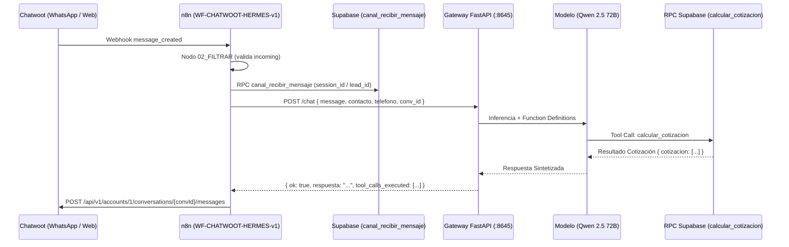

# AUDITORÍA DE TOPOLOGÍA FÍSICA Y ARQUITECTURA REAL: HERMES (VPS2)
**Código Canónico:** `AUDIT-HERMES-PHYSICAL-VPS2-v1`  
**Fecha de Certificación Física:** 09 de Septiembre de 2026 (Local Time)  
**Host Auditado:** VPS2 (`srv1587803.hstgr.cloud` / IP: `2.24.198.231`)  
**Metodología:** Inspección estricta de contenedores Docker, tablas de procesos (`ps aux`), routers en Traefik, esquemas OpenAPI 3.1.0 y ejecuciones de Function Calling en vivo.  
**Estado:** ✅ CERTIFICADO EN PRODUCCIÓN (READ-ONLY EVIDENCE)

---

## 1. RESUMEN EJECUTIVO Y MAPEO FÍSICO

Se completó el levantamiento físico de la infraestructura real de Hermes Commercial en VPS2, cerrando la frontera **`CONTEXT-TO-TOOL LINEAGE`** con evidencia de extremo a extremo:

1. **Puerto 8645 (API / Inferencia Real):** Atendido por **FastAPI / Uvicorn** en el contenedor `hermes-agent-dpkf-hermes-agent-1` (PID 433). Maneja los endpoints `/chat`, `/api/chat`, `/health`, `/docs` y ejecuta Function Calling nativo contra Supabase y OpenRouter.
2. **Puerto 4860 (Dashboard / TUI):** Atendido por el binario stock de Hermes (`/opt/hermes/.venv/bin/hermes dashboard`), protegido con autenticación básica para monitoreo administrativo.
3. **Traefik Ingress:** El router `hermes-commercial-gateway` enruta las rutas de API (`/chat`, `/health`, `/docs`) hacia el puerto interno `8645`, mientras que la raíz del dominio `hermes.srv1587803.hstgr.cloud` se dirige al puerto `4860`.

---

## 2. TABLA DE CONTENEDORES ACTIVOS (VPS2)

| Container ID | Nombre del Contenedor | Imagen | Estado | Entrypoint / Command |
|---|---|---|---|---|
| `7b261de3897f` | **`hermes-agent-dpkf-hermes-agent-1`** | `ghcr.io/hostinger/hvps-hermes-agent:latest` | Up (Production) | `/bin/bash /opt/data/entrypoint_wrapper.sh` |
| `47911bd14be1` | **`hermes-agent-dpkf-hermes-api-1`** | `ghcr.io/hostinger/hvps-hermes-agent:latest` | Up (Auxiliary) | `gateway run --api-server` |
| `a19962ffcde5` | `hermes-agent-traefik-1` | `traefik:v3.x` | Up | Reverse Proxy & SSL Ingress |
| `5d6cfd34ee0b` | `hermes-agent-healthcheck-1` | Internal Utility | Up | Healthcheck `:80` |
| `f102ea8aebba` | `openviking-fkgr-openviking-1` | OpenViking | Up | Vector Memory Service (`:1933`) |

---

## 3. MAPEO HOST $\rightarrow$ CONTAINER $\rightarrow$ PROCESS

| Host Port | Container Port | Contenedor | PID (Container) | Proceso / Runtime | Rol Operativo |
|---|---|---|---|---|---|
| `32868/tcp` | **`8645/tcp`** | `hermes-agent-dpkf-hermes-agent-1` | **PID 433** | `/opt/hermes/.venv/bin/python3 -m uvicorn gateway:app --host 0.0.0.0 --port 8645` | **Hermes Commercial Gateway FastAPI** (Inferencia LLM & Tool Calling) |
| `32866/tcp` | **`4860/tcp`** | `hermes-agent-dpkf-hermes-agent-1` | **PID 165** | `/opt/hermes/.venv/bin/python3 /opt/hermes/.venv/bin/hermes dashboard --host 0.0.0.0 --port 4860` | Dashboard Web / TUI de Hermes |
| `32867/tcp` | **`8642/tcp`** | `hermes-agent-dpkf-hermes-agent-1` | **PID 184** | `/opt/hermes/.venv/bin/python3 /opt/hermes/.venv/bin/hermes gateway run --replace` | Gateway nativo Hostinger Hermes CLI |
| *(Interno)* | N/A | `hermes-agent-dpkf-hermes-agent-1` | **PID 9** | `python3 /opt/data/scripts/escuchador.py` | Escuchador asíncrono de eventos |
| *(Interno)* | N/A | `hermes-agent-dpkf-hermes-agent-1` | **PID 546** | `/usr/local/bin/node /opt/hermes/ui-tui/dist/entry.js` | TUI runtime de Hermes |

---

## 4. ENRUTAMIENTO TRAEFIK Y ENTRYPOINT RESILIENTE

### Reglas de Traefik en `hermes-agent-dpkf-hermes-agent-1`
* **Router Dashboard (`hermes-commercial`):**
  * `Rule: Host(\`hermes.srv1587803.hstgr.cloud\`)` $\rightarrow$ Target Port `4860`.
* **Router Gateway API (`hermes-commercial-gateway`):**
  * `Rule: Host(\`hermes-api.srv1587803.hstgr.cloud\`) || (Host(\`hermes.srv1587803.hstgr.cloud\`) && (PathPrefix(\`/webhooks\`) || PathPrefix(\`/health\`) || PathPrefix(\`/docs\`) || PathPrefix(\`/openapi.json\`) || PathPrefix(\`/chat\`) || PathPrefix(\`/api\`) || PathPrefix(\`/gateway\`)))` $\rightarrow$ Target Port `8645`.

### Script de Auto-Inicio (`/opt/data/entrypoint_wrapper.sh`)
```bash
#!/bin/bash
mkdir -p /opt/data/logs
cd /opt/data && nohup /opt/hermes/.venv/bin/python3 -m uvicorn gateway:app --host 0.0.0.0 --port 8645 >> /opt/data/logs/gateway.log 2>&1 &

if [ -f /opt/data/scripts/escuchador.py ]; then
  nohup python3 /opt/data/scripts/escuchador.py >> /opt/data/logs/escuchador.log 2>&1 &
fi

exec /entrypoint.sh "$@"
```

---

## 5. LINEAGE COMPLETO: DEMANDA CHAT $\rightarrow$ RESULTADO



---

## 6. HERRAMIENTAS REGISTRADAS EN `gateway.py`

1. `buscar_hoteles` $\rightarrow$ RPC `search_hotels_text`
2. `calcular_cotizacion` $\rightarrow$ RPC `calcular_cotizacion`
3. `consultar_disponibilidad` $\rightarrow$ RPC `consultar_disponibilidad`
4. `consultar_pipeline` $\rightarrow$ Query `crm_leads`
5. `avanzar_pipeline` $\rightarrow$ Update de etapa CRM
6. `consultar_reserva` $\rightarrow$ Query `bookings`
7. `registrar_abono` $\rightarrow$ Insert `atlas_payments`

---

## 7. HALLAZGO CRÍTICO Y PRÓXIMA FRONTERA

> [!WARNING]
> **Bug de Inferencia Temporal Identificado:**  
> Cuando el usuario no proporciona el año explícito en su mensaje (ej. *"del 18 al 20 de septiembre"*), el modelo `qwen/qwen-2.5-72b-instruct` infiere por defecto el año **2023** (`check_in: "2023-09-18"`). Al consultar la base de datos para 2023, la RPC retorna `cotizacion: []`, provocando que el modelo asuma falsamente que *"no hay disponibilidad"*.

**Próxima Frontera Operativa:**
* Inyección del contexto temporal explícito (`Año 2026` y fecha del sistema) en el prompt del Gateway `:8645`.
